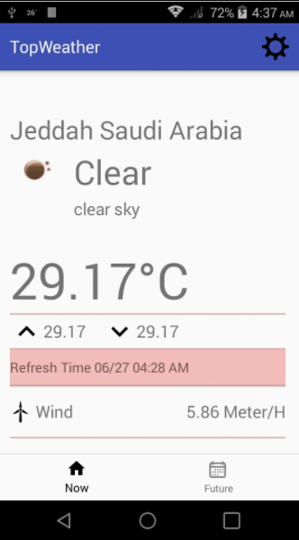

# TopWeather
fetches the weather data from openweather api in json format
[apk download](https://drive.google.com/open?id=0B-ymulPI4k4ZRGEyZ055SlNtVzg)
  **the used apis**
  - Google Places
  - open weather current
  - open weather forecast16
  - MPAndroidChart
  - picasso
  - okhttp3
  - gson
  - butterknife
 **Screens**

